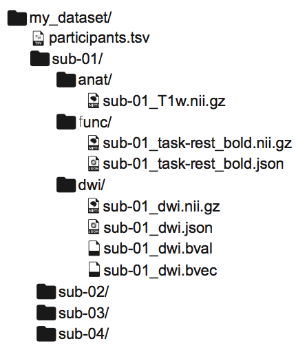
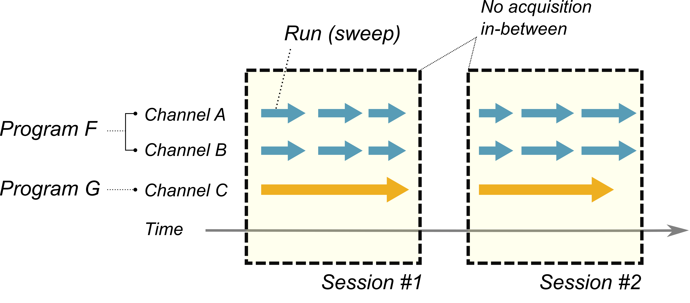
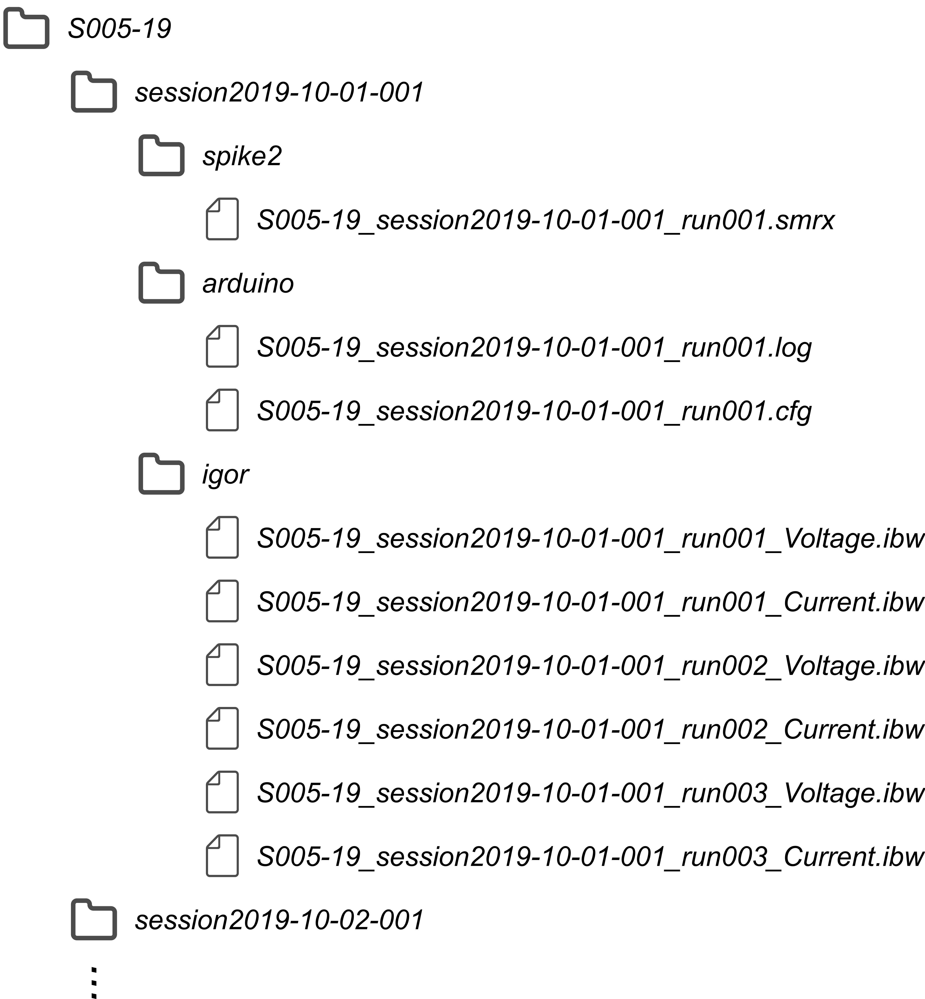
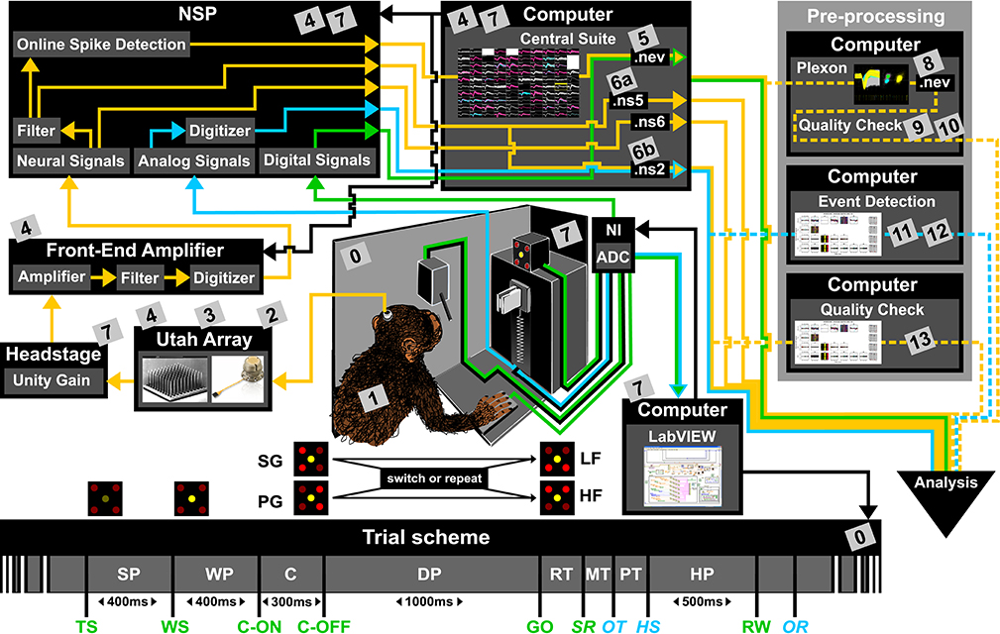

# Data organization: Let data tell what you did

Keisuke Sehara

The MIT License

## Introduction

### Why does data organization matter?

- You may not find out what data is missing for which experiment:
  - Data tends to get dispersed over time, in different hard drives, in different computers.
  - You don't remember what type of acquisitions you exactly did several years ago, even when you want to make use of it.
- It takes time to understand the others' datasets:
  - People have their own preferred way of data organization and naming conventions.

### What do I want to do?

- Build a common organization for data and metadata so that:
  - You can make use of your data yourself several years later.
  - You can make use of the others' data.
  - You can possibly publish your dataset for the others to use.

### What to save and organize?

- __Raw data__:  which is _very_ difficult to define...
  - "Any first-order experimental quality being acquired or generated with the use of a distinct method, and being stored to be analyzed later" (Sehara, 2019)
  - In principle, any experimental quality that are acquired and stored by a program (including a human being) may be a set of raw data.
  - Videos, traces of physiological measurements, annotated states of behavior or a behavioral task etc.
  - The data you obtained through conversion or analysis is normally _not_ considered as the raw data (but there are always some exceptions e.g. when your data uses a closed/proprietary format).
- __Metadata__: information and settings that are used to obtain the raw data, including:
  - _Information about animals_: e.g. species/strain/sex, date of birth, animal-specific experimental conditions, date of surgery, dates of behavioral trainings and sessions
  - _Information about experimental conditions_: e.g. type of the virus/drug(s) used, the protocol of viral/drug injection (method/area/type etc.), the type and the algorithm of the behavioral task or the stimulation protocol, input resistance of the pipette
  - _Information about acquisition hardwares_: e.g. part number, filter/gain settings

## Organization of raw data

### BIDS: a way to organize "brain-imaging" data

- Forces to use a specific directory structure: `/ (Subject) / (Session) / (Data type) / (Data files) `
- Recommends to split between "raw-data/metadata" and "derived data"
- Makes it (a little bit) simpler to "make sense of the dataset"

### A way of standardizing an experiment

Here I show my assumptions on how an experiment may be organized: the important concepts include _channels_, _runs_, _programs_ and _sessions_.

- A __channel__ represents _a single experimental quality_ recorded during an experiment, e.g.:
  - intracellular voltage
  - calcium signal
  - input from the lick port
- A __run__ (or a __sweep__) represents _a single, continuous run of acquisition_.
  - A single run may involve _simultaneous acquisition_ of multiple channels.
  - Different channel data acquired during a single run may be saved to a single output file or, alternatively, to a set of  files.
- A __program__ represents _a distinct thread of acquisition_.
  - If you need to perform _synchronization / alignment_ during data analysis, it implies the existence of multiple programs.
  - Different programs typically do not share the same _timebase_ or the same _temporal boundaries between runs_.
  - Acquisition of channels in the same, single run is controlled through a single program.
- A __session__ represents a _group of acquisitions_ being run (possibly) by multiple programs.
  - There must be no acquisitions between sessions.
  - For behavioral experiments, one single behavioral session typically corresponds to a session.
  - For *in vivo* anesthetized experiments, I presume a single field-of-view, a single insertion or a cell-of-interest may correspond to a session, depending on the type of your experiment.
  - For *in vitro* slice experiments, either a cell, a slice or a field-of-view corresponds to a session, depending on the type of your experiment.

### My suggestion: rDOPE

- Use the organization of `/ (Subject) / (Session) / (Program) / (Data)`
- You can use __alphabets, numbers and the hyphen ([a-zA-Z0-9-])__ for file/directory name components (subject name, program name etc.).
  - Underscores "_" are only used to concatenate name components in file names.
  - There are no limitations for extensions / suffices, as long as it is "valid".
- Session names must be in the format: `sessionYYYY-MM-DD-NNN`
  - You must add the session number `NNN` (001, 002, ...) even when you run only one session per day.
  - Depending on the type of your experiment (and on the way you feel comfortable), the use of `insertionYYYY-MM-DD-NNN`, `viewYYYY-MM-DD-NNN`, `cellYYYY-MM-DD-NNN` or `sliceYYYY-MM-DD-NNN` is also allowed. No matter which convention you want to use, it is recommended that you adhere to a single naming convention.
- Each program must have its own sub-directory under the session directory.
  - This applies even when you use only one program for acquisition (this will have some relevance as you add metadata in the session directory).
  - For the moment, you can name them in the way you like (as long as it conforms to the naming convention described above).
- Each data file must have _the subject name, the session name and the run name concatenated_ using the underscores (_).
  - The names must appear in this order.
  - You must add the run name in the format `runNNN` (in 3 digits) even when you have only one run for the given program.
  - You can append some additional information as you like (e.g. channel name, some important experimental conditions).

## Organization of metadata

### A complex nature of metadata

(Image from [Zehl et al., 2016 Front Neuroinform](https://doi.org/10.3389/fninf.2016.00026))

- To describe the complete picture of experiments, there are too many variables to explain.
- Even then, we still don't know whether description of variables of this number is sufficient for reproducing our data:
  - Let's not think about _whether_ it is sufficient for reproduction.
  - In any case, making notes on what you did helps you remember/describe your experiments.

### Focusing on the multi-dimensional structure

- Experiments are multi-dimensional in nature
  - Temporal (perturbations, recordings)
  - Spatial (hardwares, stereotactic, laminar)
  - Qualitative (channels and programs for acquisition)
  - Logical (task structure, genetic encoding)
- Every single entity:
  - spans across some dimensions simultaneously
  - exists in a certain relationship with the others

