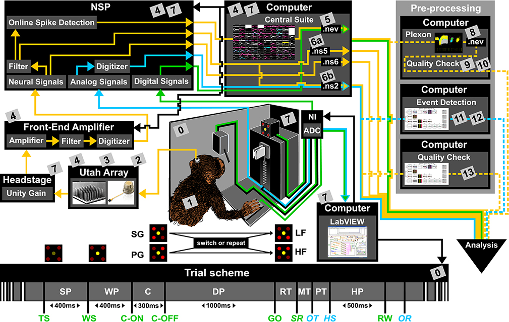
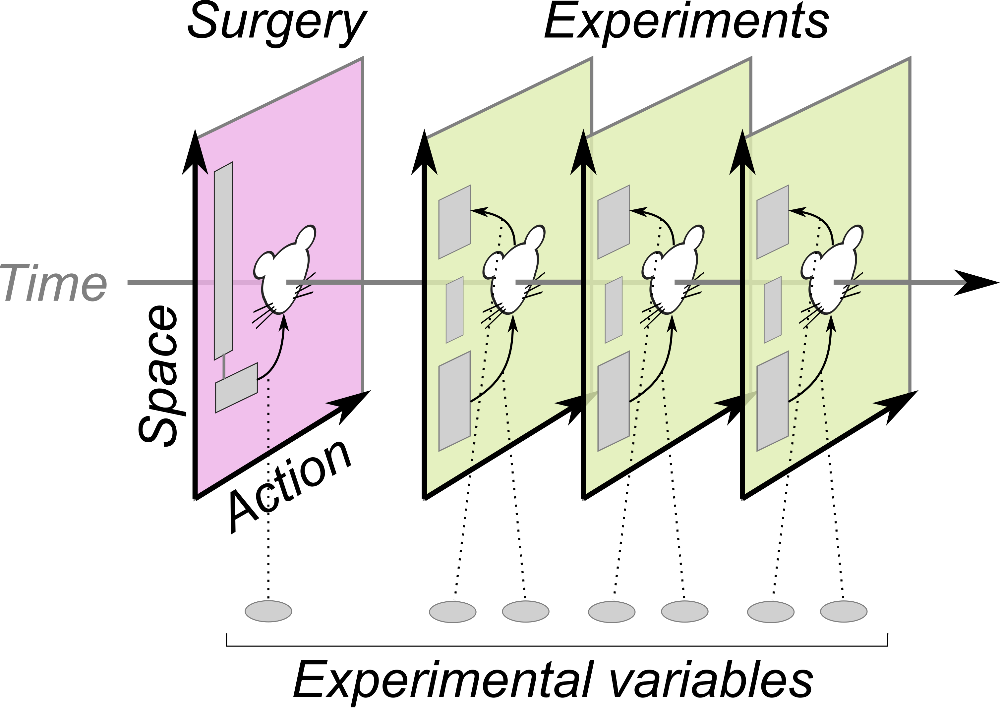

Organization of metadata
========================

Metadata is complex
-------------------

   An attempt on gathering metadata for an experiment.
   The image taken from `Zehl et al., 2016 Front Neuroinform <https://doi.org/10.3389/fninf.2016.00026>`_.

- To describe the complete picture of experiments, there are too many variables to explain.
- Even then, we still don't know whether description of variables of this number
  is sufficient for reproducing our data:

  - Let's not think about *whether* it is sufficient for reproduction.
  - No matter if it is reproducible, making notes on what you did
    helps you remember/describe your experiments.

Focusing on the multi-dimensional structure
-------------------------------------------

Probably, structuring the metadata helps organize our thoughts.

- Experiments are multi-dimensional by nature:

  - Temporal (perturbations, recordings)
  - Spatial (hardwares, stereotactic, laminar)
  - Qualitative (channels and programs for acquisition)
  - Logical (task structure, genetic encoding)

- Every single entity in an experiment:

  - spans across several dimensions simultaneously.
  - exists in a certain relationship with the others.

amorphys: an attempt to organize metadata
-----------------------------------------

=============== ==================================================================================================
Page            URL
=============== ==================================================================================================
Project website `https://github.com/gwappa/amorphys <https://github.com/gwappa/amorphys>`_
Documentation   `https://amorphys-documentation.readthedocs.io/ <https://amorphys-documentation.readthedocs.io/>`_
=============== ==================================================================================================

- Description of experiments based on several concepts:

  - **Entity**: description of physical existence
  - **Relationship**: description of relationships between entities
  - **Variable**: description of experimental variables

- Choices of markup languages:

  - JSON/YAML
  - XML
