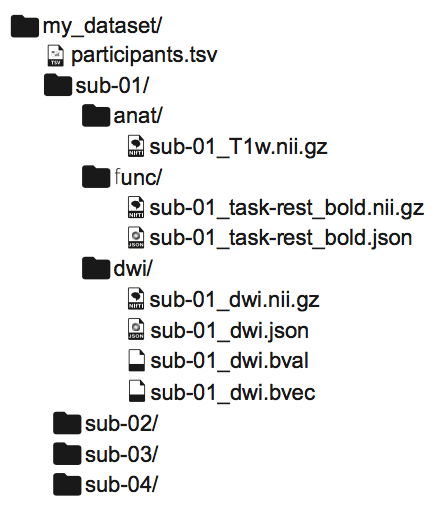
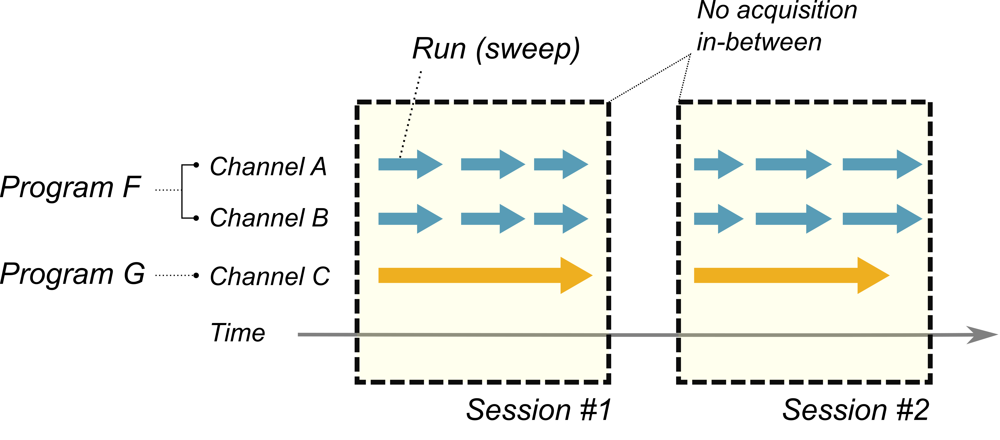
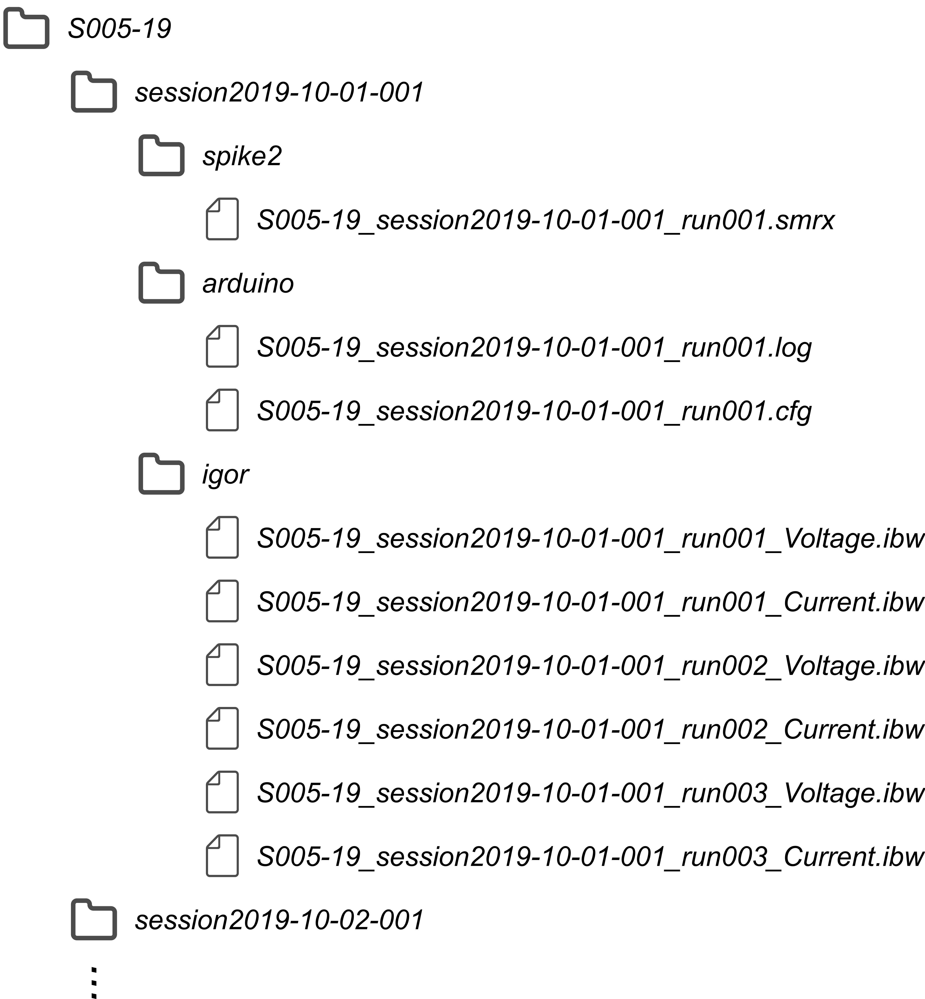

Organization of raw data
========================

BIDS: a way to organize "brain-imaging" data
--------------------------------------------

   
   Data organization in BIDS,
   from `Gorgolewski et al., 2016 Sci Data <https://dx.doi.org/10.1038/sdata.2016.44>`_.

"Brain Imaging Data Structure (BIDS)" is the data structure proposed 
in `Gorgolewski et al., 2016 Sci Data <https://dx.doi.org/10.1038/sdata.2016.44>`_.

- Forces to use a specific directory structure:
  `/ (Subject) / (Session) / (Data type) / (Data files)`
- Recommends to split between "raw-data/metadata" and "derived data"
- Makes it (a little bit) simpler to "make sense of the dataset"

As it is easy to understand, I decided to base raw data organization 
on this format.

A way of standardizing an experiment
------------------------------------

   Temporal organization of an experiment.
   It is based on concepts such as 
   channels, runs, programs and sessions.

Here I show my assumptions on how an experiment may be organized:
the important concepts include *channels*, *runs*, *programs* and *sessions*.

- A **channel** represents a *single experimental quality* 
  recorded during an experiment, e.g.:

  - intracellular voltage
  - calcium signal
  - input from the lick port

- A **run** (or a **sweep**) represents a *single, continuous run of acquisition*.

  - A single run may involve *simultaneous acquisition* of multiple channels. 
  - Different channel data acquired during a single run may be saved to 
    a single output file or, alternatively, to a set of files.

- A **program** represents a *distinct thread of acquisition*.

  - If you need to perform *synchronization* or *alignment* during data analysis,
    it implies the existence of multiple programs.
  - Different protrams normally do not share the same *timebase* or the same *temporal boundaries between runs*.
  - Acquisition of channels in the same, single run is controlled through a single program.

- A **session** represents a *group of acquisitions* being executed by,
  possibly, multiple programs.

  - There must be no acquisitions between sessions.
  - For behavioral experiments, one single behavioral session
    typically corresponds to a session.
  - For *in vivo* anesthetized experiments, I presume a single field-of-view,
    a single insertion or a cell-of-interest may correspond to a session,
    depending on the type of your experiment.
  - For *in vitro* slice experiments, either a cell, a slice or a field-of-view 
    corresponds to a session, depending on the type of your experiment.

My suggestion: rDOPE
--------------------

   
   Proposed raw-data structure for rDOPE.

A raw-data organization of physiology experiments (rDOPE) is inspired by BIDS, and uses the organization of `/ (Subject) / (Session) / (Program) / (Data)`.

- You can use **alphabets, numbers and the hyphen ([a-zA-Z0-9-])** for file- and directory-name components (subject name, program name etc.).
  
  - Underscores "_" are only used to concatenate name components in file names.
  - For the time being, there are not length limitations for names.
    There may be issues on some older operating systems.
  - There are no limitations for extensions / suffices, as long as it is "valid".

- Session names must be in the format: `sessionYYYY-MM-DD-NNN`.

  - You must add the session number `NNN` (001, 002, ...) even when 
    you run only one session per day.
  - Depending on the type of your experiment (and on the way you feel comfortable), 
    the use of a different prefix is also allowed:
    
    - `sessionYYYY-MM-DD-NNN`
    - `insertionYYYY-MM-DD-NNN`
    - `viewYYYY-MM-DD-NNN`
    - `cellYYYY-MM-DD-NNN` 
    - `sliceYYYY-MM-DD-NNN`
      
    No matter which convention you want to use, it is recommended that you adhere 
    to a single naming convention.

- Each program must have its own sub-directory under the session directory.

  - This applies even when you use only one program for acquisition (this will have some relevance as you add metadata in the session directory).
  - For the moment, you can name them in the way you like (as long as it conforms to the naming convention described above).

- Each data file must have the *subject name*, the *session name* and the *run name*
  concatenated with the underscore.
  
  - The names must appear in this order.
  - You must add the run name in the format `runNNN` (in 3 digits) even when you have only one run for the given program.
  - You can append some additional information as you like (e.g. channel name, some important experimental conditions).

